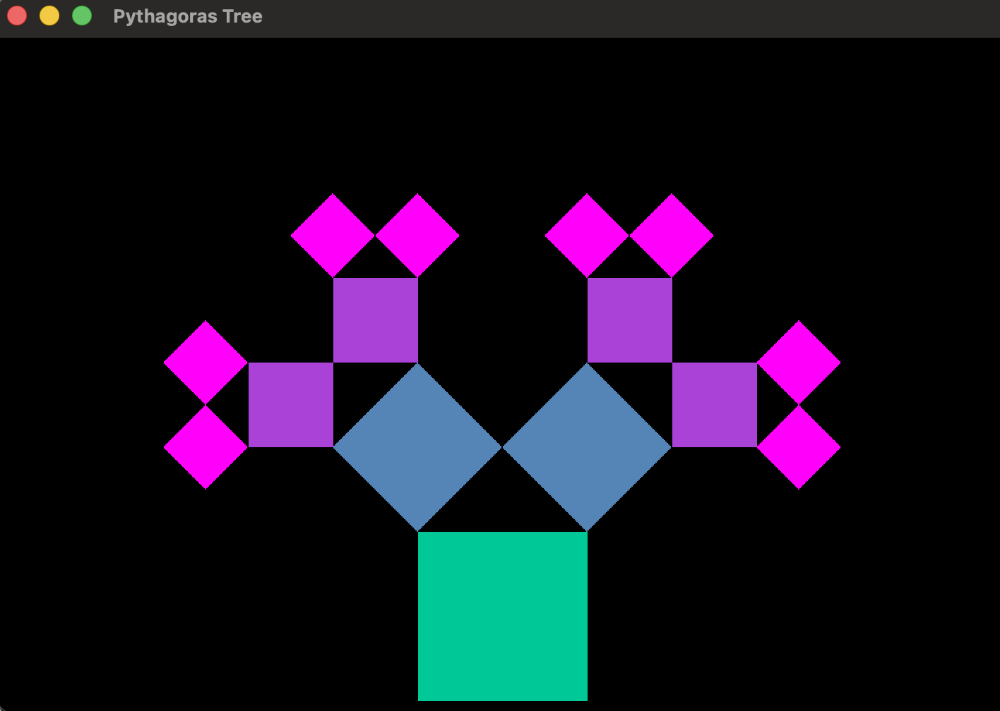

# PS2: Pythagorean Tree

## Contact
Name: Aanya Bharti
Section: 203
Time to Complete: Approximately 8–10 hours

## Description
This project implements a recursive Pythagorean Tree using SFML graphics.
The program draws a base square of side length L and recursively generates
two child squares at each level until recursion depth N is reached.

The program takes two required command-line arguments:

- L — side length of the base square (double)
- N — recursion depth (int)

- An optional third argument was added that specifies the angle of the inner triangle.
If no angle is provided, it defaults to 45 degrees.

The window is sized to 6L × 4L to ensure the full tree fits within
the screen without clipping.

### Features
The tree is implemented as a class `PTree` derived from `sf::Drawable`,
so it can draw itself directly to the window.

Each square is represented using `sf::RectangleShape`. The origin of
each square is moved to its bottom-left corner using `setOrigin()`.
This allows the square to rotate correctly so that the tree grows
upward from the base.

The recursive helper function `drawTree()` receives:
- The bottom-left position of the square
- The side length
- The rotation angle (in degrees)
- The remaining recursion depth
- The current level (used for coloring)

Child positions are calculated using trigonometry:

If a parent square has side length S and angle θ:
- Left child size  = S × cos(θ)
- Right child size = S × sin(θ)

The top-left and top-right corners of the parent square are computed
using an SFML transformation matrix. The left child is attached to
the top-left corner and rotated by −θ. The right child is attached
to the top-right corner and rotated by (90° − θ).

An offset vector is applied to the right child so that its bottom-right
corner aligns correctly. This ensures that each group of three squares
forms a right triangle, matching the mathematical definition of the
Pythagorean Tree.

### Issues
The most challenging part of this project was correctly positioning
the right child square so that the three squares formed a perfect
right triangle. The offset calculation required careful reasoning
with rotation angles and trigonometric functions.

Another challenge was understanding how SFML handles rotation around
an origin point. By default, shapes rotate around their top-left corner,
so moving the origin to the bottom-left corner was necessary to make
the tree grow upward properly.

After debugging transformations and carefully adjusting the math,
the tree aligns correctly and matches the expected geometric structure.

### Extra Credit
The following extra features were implemented:

1. Multiple colors are used at different recursion levels. A gradient
   effect is applied based on depth to visually distinguish levels.

2. The program accepts an optional third command-line argument that
   specifies the angle of the inner triangle. If no value is provided,
   the angle defaults to 45 degrees.

3. Interactive controls (additional reasonable extension):
   - Left/Right arrow keys decrease/increase recursion depth.
   - Up/Down arrow keys decrease/increase the angle dynamically.

These features allow experimentation with different tree shapes and
visual behaviors.

## Screenshot
The screenshot file `screenshot.png` shows representative output of
the program for L = 120 and N = 3.

## Command
  make
./PTree 120 3

## Acknowledgements
I used the official SFML documentation for reference on transformations,
rotation, and event handling. I also referenced standard C++ documentation
for trigonometric functions and command-line argument parsing.
